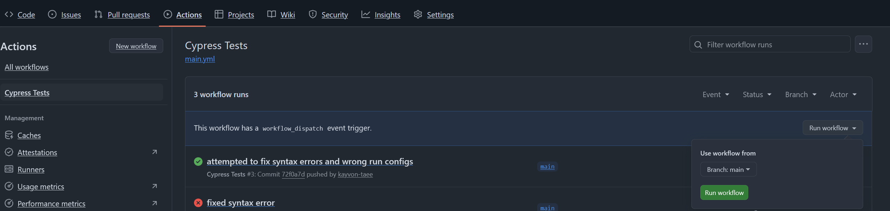

# My solution

Note: I personally prefer working with next.js and react, however, given the requirement to be SPA, I will use vite.

Make sure to npm install all dependencies before running the application or running any tests. I have used npm for this project.

## Running the app

Assuming you've installed all the dependencies, please use the `npm run dev` command to run the application.

## Running tests

There are two ways of running the tests.

1. I've designed the project such that if you have any issues running the tests locally, you can use the github runners. On the repository, find the actions tab and click on the cypress tests option. You should see an option to run the workflow. Please do this on the main branch.

2. You can use the shell script to easily run the tests all at once. Note that I am using bash, so make sure the device you use can access the application dependencies and run bash scripts. Make sure to run this at the project root directory.
`bash run_all_tests.sh`. You may need to reply with a 'y' prompt if you need to install the `wait-on` package.

## What would I do if I had more time?

I was having issues with running component tests with cypress. Trying to fix them would result me overshooting the time limit. I would isolate my tests and have a better separation of cypress component and e2e testing.
I would also like to add a file management feature, where the user can add, edit and remove the uploaded files. Adding the files should be done via modal and the user can simply drag and drop the file onto the interface.
Finally, I would adjust the data structure to ensure all of them have unique IDs instead of relying on names.

For now, I assumed that there will be no empty folders added, but with more time, I would make the property optional. Also, a future feature should accommodate greater nesting of folders and allow many sub folders to be visible.
I would also replace the deprecated Grid with Grid v2.